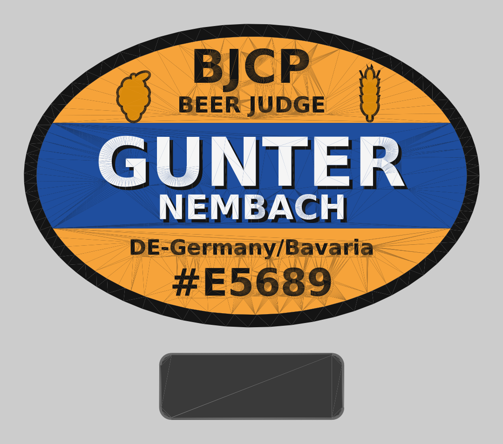

# BJCP Judge Badge – persönliches Unikat (EXP)

**Stand:** 2026-10-08 (Rev. 2, Redesign) · **Revision:** EXP (experimentell, nicht freigegeben) · **Prozess/Material:** FDM, PLA (Mehrfarb), 0,2-mm-Düse



*(Vorschau: Draufsicht; unten die Magnet-Gegenplatte. Dreiecks-Linien sind Render-Artefakte.)*

## 1 Änderungen Rev. 2 (Anforderungen → Umsetzung)

| Anforderung | Umsetzung |
|---|---|
| „Gunter" deutlich größer als „Nembach" | GUNTER 16 mm Schriftgröße (Versalhöhe ≈ 11,7 mm), NEMBACH 8 mm (≈ 5,8 mm) – Faktor 2 |
| „BJCP" / „Beer Judge" symmetrisch | beide auf Mittelachse x = 0 zentriert; links Hopfen, rechts Gerste spiegelbildlich angeordnet |
| Feine Düsen | Auslegung für **0,2-mm-Düse**, 0,1 mm Schichthöhe (alle Z-Maße Vielfache von 0,1 mm), kleinste Details ≥ 0,5 mm |
| Erhaben **und** vertieft | Schrift erhaben (Name 1,2 mm, übrige 0,8 mm) **plus** eingravierte Schlagschatten-Nut unten rechts (Name: voll bis zur schwarzen Platte; kleine Schrift auf Orange: 0,4 mm flach) + gravierte Schuppen im Hopfen |
| Hopfen und Malz | Hopfendolde (links) und Gerstenähre (rechts), Bernstein mit schwarzer Kontur |
| Magnet-Befestigung ohne Beschädigung | 2 Neodym-Scheiben Ø10 × 2 mm im Badge (Rückseite) + **Gegenplatte** 44 × 16 × 3 mm mit 2 Magneten innen am Hemd; Stoff liegt dazwischen |
| Marketing / Wirkung | siehe Abschnitt 5 |

## 2 Annahmen / Funktion

| Punkt | Festlegung |
|---|---|
| Zweck | Namensschild für Bierbewertungen in schwach beleuchteten Räumen; **ausschließlich persönliche Nutzung, Unikat** |
| Last | Masse ≈ 31 g (`estimated`, aus Volumen × 1,24 g/cm³); kein sicherheitsrelevantes Bauteil |
| Farben | `ASSUMPTION`: aus der *verbalen* Beschreibung der BJCP-Marke (Markenanmeldung: schwarz, weiß, orange, blau, bernstein). Offizielle Pantone/Hex-Werte: `k.A.`; Hex in `badge_params.py` sind `estimated` |
| Logo | Keine Kopie des BJCP-Logos; Layout ist eigene Interpretation. Keine Weitergabe/Vervielfältigung (Marke) |
| Personendaten | Name/BJCP-ID stecken in den Exportdateien → **nicht ins öffentliche Repo committen** |

## 3 Maße und Schichtaufbau (Parameter in `badge_params.py`)

| Parameter | Wert |
|---|---|
| Oval | 108 × 72 mm, Rand 3,0 mm, Namensband ±12,5 mm |
| Z-Stack | 0–3,0 schwarze Platte · 3,0–3,8 orange/blaue Felder · 3,8–4,6 Relief (Text/Symbole) · 3,8–5,0 Name · Rand bis 4,6 |
| Magnetaschen (Rückseite) | 2 × Ø10,3 × 2,2 mm tief, Abstand 30 mm, Restboden 0,8 mm (`ASSUMPTION`: Spiel 0,3 mm – per Testdruck kalibrieren) |
| Gegenplatte | 44 × 16 × 3,0 mm, gleiche Taschen (Öffnung zum Stoff), Kanten 0,6 mm gerundet, Ecken R3 |
| Optional | `lanyard_tab=True` erzeugt Lasche mit Langloch 9 × 3,6 mm |
| Schrift | DejaVu Sans Bold; Strichstärken ≥ 0,75 mm |

## 4 Farb-/Körperzuordnung

| Körper (STL) | Filament |
|---|---|
| `black` | Schwarz matt (Platte, Rand, Text auf Orange, Konturen) |
| `orange` | Hellorange |
| `blue` | Mittelblau |
| `white` | Weiß, **empfohlen nachleuchtend** (Name) – gehärtete Düse, abrasiv; ohne Glow-Effekt dann normales Weiß |
| `amber` | Bernstein (Hopfen, Gerste) |
| `counterplate` | beliebig (z. B. Schwarz/Grau), nicht im Sichtbereich |

## 5 Marketing-/Wirkungskonzept

| Maßnahme | Begründung | Status |
|---|---|---|
| Vorname dominant (2× Größe), Nachname sekundär | Wiedererkennung/Ansprache beim Judging und Networking („Gunter") | umgesetzt |
| Weiß-auf-Blau mit schwarzem Tiefenschatten | höchster Kontrast im Zentrum; Lesbarkeit bei wenig Licht | umgesetzt |
| Nachleuchtender Name (optional) | Wiedererkennungseffekt im Dunklen; Leuchtdauer/-helligkeit `k.A.` (Herstellerdaten/Eigenmessung) | optional |
| Hopfen + Gerste, symmetrisches Wappen-Layout | sofort als Bier-/Brau-Thema lesbar, hochwertiger Eindruck | umgesetzt |
| Magnetbefestigung | schnell an-/abzunehmen, keine Löcher im Hemd, wirkt professionell | umgesetzt |
| Rang (Recognized/Certified/National/…) als Zusatzzeile | Aussage zur Qualifikation – Rang des Nutzers: `k.A.` | **Kann**, Angabe nötig |
| Firmenkürzel/Logo (z. B. NCFAI) oder QR-Code auf der Rückseite/Gegenplatte | Kontaktpfad, Beratungsangebot – widerspricht dem Zweck „rein persönlich"; nur nach Entscheidung des Nutzers | **Kann**, Entscheidung offen |

## 6 Druckempfehlung (Startwerte, `ASSUMPTION`, nicht kalibriert)

| Parameter | Wert |
|---|---|
| Düse | **0,2 mm** (Linienbreite ≈ 0,22 mm); Schichthöhe 0,1 mm (1. Schicht 0,1) |
| Ausrichtung | flach, Rückseite (Magnettaschen) auf dem Bett; Gegenplatte Taschen nach unten; keine Stützen |
| Farbwechsel | exakt bei z = 3,0 und 3,8 mm (+ 4,6 mm für den höheren Namen) |
| Wände/Infill | ≥ 4 Perimeter bzw. 100 % in Farbschichten |
| PLA | ca. 205–215 °C / 55–60 °C Bett; Datenblatt des Filaments maßgeblich |
| Druckzeit | `estimated` 8–16 h plus Farbwechsel mit 0,2-mm-Düse – im Slicer prüfen |
| Schrumpfkompensation | keine (erst nach Messdaten) |

Hinweis PLA: formstabil nur bis ca. 55–60 °C (nicht im heißen Auto liegen lassen).

## 7 Magnetmontage

1. Taschen ggf. nacharbeiten (Spiel prüfen), Magnete mit Cyanacrylat/Epoxid einkleben, bündig oder leicht versenkt.
2. **Polarität:** Badge links Nordpol zum Stoff, rechts Südpol; Gegenplatte links Südpol, rechts Nordpol → anziehend und gegen Verdrehen gesichert. Vor dem Verkleben mit Prüfmagnet/Kompass verifizieren.
3. Gegenplatte innen am Hemd, Badge außen; Stoff zwischen beiden einklemmen. Haltekraft: Ø10×2-NdFeB-Scheibe typ. ≈ 1 kg Zugkraft im direkten Kontakt (`estimated`, Herstellerwerte `k.A.`); durch Stoffdicke deutlich geringer – Eigenversuch nötig.

**Sicherheit:** Neodym-Magnete von Herzschrittmachern/Implantaten, Kreditkarten und Datenträgern fernhalten, vor Kleinkindern schützen (Verschlucken). Kein Nachweis für Dauerhaltbarkeit am bewegten Hemd; bei empfindlichen Stoffen Gewebe vorab testen.

## 8 Reproduktion

```bash
python -m venv .venv && .venv/bin/pip install cadquery
.venv/bin/python cad/functional-prototypes/bjcp-judge-badge/bjcp_badge.py --out exports \
    --first-name Gunter --last-name Nembach --bjcp-id E5689 --location "DE-Germany/Bavaria"
```

Laufzeit ca. 1 min. Exit-Code 1, wenn Relief näher als 0,8 mm am Rand liegt oder farbverschiedene
Reliefkörper kollidieren (`check_fit`).

## 9 Validierung (durchgeführt, 2026-10-08)

| Prüfung | Ergebnis |
|---|---|
| Alle 6 STL + 3MF-Objekte wasserdicht, konsistente Normalen (trimesh) | bestanden |
| Randabstand Relief ≥ 0,8 mm, keine Überlappung Schwarz/Weiß/Bernstein | bestanden |
| ruff format/check, pytest (Parameter + Geometrie) | bestanden |
| Slicer-Vorschau, Probedruck (Taschenspiel, Magnetkraft, Details mit 0,2 mm), Lesbarkeit bei 5–10 lx | **offen** |

## 10 Offene Punkte / Folge-Exercise

- Probedruck → Taschen-Passung, Haltekraft durch Stoff, Detailtreue Hopfen/Gerste/Schatten, Lesbarkeit bei Dunkelheit (`EX-NNN`).
- Kleinste Schrift (Ort 5,0 mm) und Gersten-Grannen (0,5 mm) sind die kritischsten Details.
- Rang-Zeile und Firmenzusatz: Entscheidung des Nutzers.
- Pantone-/RAL-Abgleich der Filamentfarben gegen das BJCP-Logo: `k.A.`
